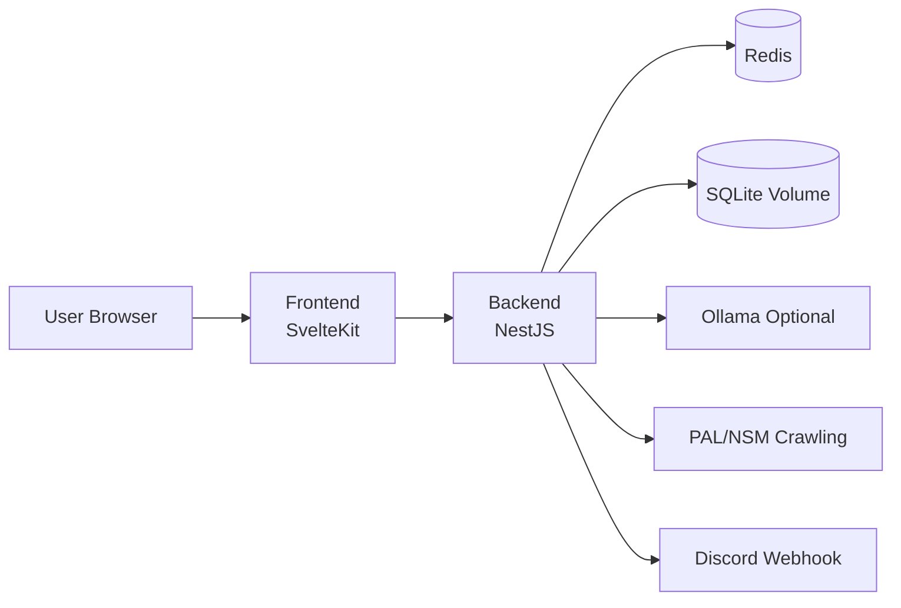

# LawCast

LawCast는 국회 입법예고 변동을 수집해 Discord 웹훅 알림과 웹 UI로 보여주는 셀프호스트형 플랫폼입니다.

이 저장소는 백엔드/프론트엔드 서브모듈을 묶는 루트 오케스트레이션 레이어이며, 역할은 다음과 같습니다.

- 서비스 전체 실행/배포 진입점 제공
- 백엔드 + 프론트엔드 개발 동선 통합
- Docker Compose 기반 운영 구성 관리

## 이 저장소의 방향성

루트 README는 **빠르게 이해하고 바로 실행**하기 위한 허브 문서입니다.

- 백엔드 아키텍처/크론/데이터 무결성 상세는 백엔드 문서에서 관리합니다.
- UI 구조/페이지/필터 UX 상세는 프론트엔드 문서에서 관리합니다.
- 루트 문서는 시스템 관점(구성, 실행 순서, 운영 스크립트)에 집중합니다.

## 시스템 구성



## 리포지토리 구조

- [backend](backend): NestJS API 서버 서브모듈
- [frontend](frontend): SvelteKit 웹 앱 서브모듈
- [docker-compose.yml](docker-compose.yml): 통합 컨테이너 오케스트레이션
- [deploy.sh](deploy.sh): 서비스별/전체 롤링 업데이트 스크립트
- [submodule_util.sh](submodule_util.sh): 서브모듈 동기화/업데이트 유틸리티

## 핵심 사용자 가치

- 입법예고 자동 수집 및 Discord 실시간 알림
- 로그인 없는 웹훅 등록 UX
- 전체 입법예고 조회, 검색/날짜 필터/정렬
- AI 요약 브리핑 카드 및 원문 조회 페이지
- 요약 오류 가능성 고지 포함(참고용 안내)

## 빠른 시작

### 1) 서브모듈 준비

```bash
git submodule update --init --recursive
```

### 2) 로컬 개발 실행

백엔드

```bash
cd backend
npm install
npm run start:dev
```

프론트엔드

```bash
cd frontend
npm install
npm run dev
```

- 기본 접속 주소: 프론트엔드 http://localhost:5173
- API 기본 주소(개발): 백엔드 http://localhost:3001

환경 변수 상세는 아래 문서를 참고하세요.

- [backend/README.md](backend/README.md)
- [frontend/README.md](frontend/README.md)

## Docker Compose 실행 (권장 운영 경로)

```bash
docker compose up -d --build
```

기본 포트

- Frontend: 127.0.0.1:3002
- Backend: 127.0.0.1:3001
- Redis: 127.0.0.1:6399
- Ollama: 127.0.0.1:11434

중지

```bash
docker compose down
```

## 운영 스크립트

### deploy.sh

- 전체 롤링 업데이트

```bash
./deploy.sh
```

- 특정 서비스만 업데이트

```bash
./deploy.sh backend
./deploy.sh frontend
```

- 서비스 목록 조회

```bash
./deploy.sh list
```

### submodule_util.sh

- 서브모듈 원격 정보 동기화: ./submodule_util.sh sync
- 최신 커밋으로 업데이트: ./submodule_util.sh update
- 특정 브랜치로 전환/동기화: ./submodule_util.sh branch <branch-name>

## 문서 맵

- 백엔드 상세: [backend/README.md](backend/README.md)
- 프론트엔드 상세: [frontend/README.md](frontend/README.md)

## 라이선스

MIT License

자세한 내용은 [LICENSE](LICENSE) 파일을 참고하세요.

## 참고 프로젝트

- [pal-crawl](https://github.com/vientorepublic/pal-crawl): 국회 입법예고 크롤러 라이브러리
- [pal-webhook](https://github.com/vientorepublic/pal-webhook): Discord 웹훅 알림 참조 구현
