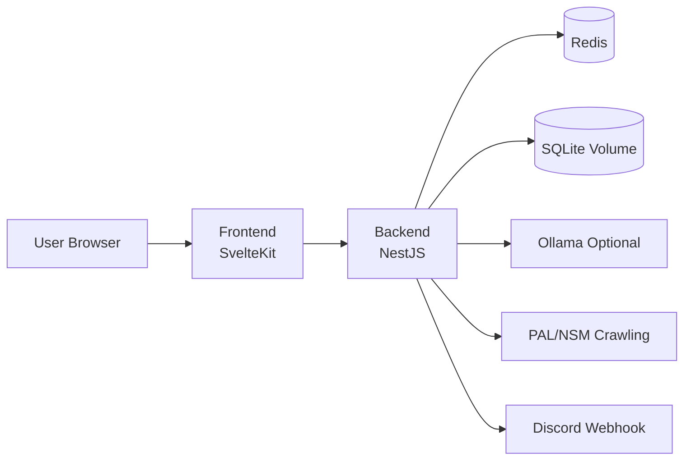

# LawCast

[](https://github.com/vientofactory/LawCast/actions/workflows/ci.yml)

LawCast는 국회 입법예고 변동을 수집해 Discord 웹훅 알림과 웹 UI로 보여주는 셀프호스트형 플랫폼입니다.

이 저장소는 백엔드/프론트엔드 서브모듈을 묶는 루트 오케스트레이션 레이어이며, 역할은 다음과 같습니다.

- 서비스 전체 실행/배포 진입점 제공
- 백엔드 + 프론트엔드 개발 동선 통합
- Docker Compose 기반 운영 구성 관리

## 이 저장소의 방향성

루트 README는 **빠르게 이해하고 바로 실행**하기 위한 허브 문서입니다.

- 백엔드 아키텍처/크론/데이터 무결성 상세는 백엔드 문서에서 관리합니다.
- UI 구조/페이지/필터 UX 상세는 프론트엔드 문서에서 관리합니다.
- 루트 문서는 시스템 관점(구성, 실행 순서, 운영 스크립트)에 집중합니다.

## 시스템 구성


```mermaid
flowchart LR
	U[User Browser] --> F[Frontend\nSvelteKit]
	F --> B[Backend\nNestJS]
	B --> R[(Redis)]
	B --> D[(SQLite Volume)]
	B --> O[Ollama Optional]
	B --> P[PAL/NSM Crawling]
	B --> W[Discord Webhook]
```

## 리포지토리 구조

- [backend](backend): NestJS API 서버 서브모듈
- [frontend](frontend): SvelteKit 웹 앱 서브모듈
- [semantic-search](semantic-search): 의미 검색 사이드카 (Python + FAISS) 서브모듈
- [docker-compose.yml](docker-compose.yml): 통합 컨테이너 오케스트레이션
- [deploy.sh](deploy.sh): 서비스별/전체 롤링 업데이트 스크립트
- [submodule_util.sh](submodule_util.sh): 서브모듈 동기화/업데이트 유틸리티

## 핵심 사용자 가치

- 입법예고 자동 수집 및 Discord 실시간 알림
- 로그인 없는 웹훅 등록 UX
- 전체 입법예고 조회, 검색/날짜 필터/정렬
- AI 요약 브리핑 카드 및 원문 조회 페이지
- 요약 오류 가능성 고지 포함(참고용 안내)

## 빠른 시작

### 1) 서브모듈 준비

```bash
git submodule update --init --recursive
```

### 2) 로컬 개발 실행

백엔드

```bash
cd backend
npm install
npm run start:dev
```

프론트엔드

```bash
cd frontend
npm install
npm run dev
```

- 기본 접속 주소: 프론트엔드 http://localhost:5173
- API 기본 주소(개발): 백엔드 http://localhost:3001

### 외부 프록시(ngrok 등) 사용 시

ngrok 등 외부 프록시를 통해 개발 서버를 공유하는 경우, Vite HMR WebSocket이 정상 동작하도록 `REMOTE_DEV` 환경 변수를 설정해야 합니다.

```bash
REMOTE_DEV=1 npm run dev
```

이 설정은 HMR 프로토콜을 `ws` → `wss`, 클라이언트 포트를 `undefined` → `443`으로 변경하여 외부 프록시 환경에서 WebSocket 연결이 차단되는 문제를 방지합니다.

환경 변수 상세는 아래 문서를 참고하세요.

- [backend/README.md](backend/README.md)
- [frontend/README.md](frontend/README.md)

## Docker Compose 실행 (권장 운영 경로)

```bash
docker compose up -d --build
```

기본 포트

- Frontend: 127.0.0.1:3002
- Backend: 127.0.0.1:3001
- Redis: 127.0.0.1:6399
- Ollama: 127.0.0.1:11434
- Semantic Search: 127.0.0.1:8300 (내부 서비스, 디버깅용 loopback 노출)

시맨틱 검색 사이드카는 `semantic-search/artifacts/`(인덱스 산출물, gitignore)를
호스트에서 바인드 마운트하고 모델 가중치(~2.2GB)는 `lawcast_semantic_hf_cache`
볼륨에 1회 다운로드합니다. 최초 기동 전 인덱스 준비 방법은
[semantic-search/README.md](semantic-search/README.md)의 프로덕션 배포 절을 참고하세요.

중지

```bash
docker compose down
```

## 운영 스크립트

### deploy.sh

- 전체 롤링 업데이트

```bash
./deploy.sh
```

- 특정 서비스만 업데이트

```bash
./deploy.sh backend
./deploy.sh frontend
```

- 서비스 목록 조회

```bash
./deploy.sh list
```

### submodule_util.sh

- 서브모듈 원격 정보 동기화: ./submodule_util.sh sync
- 최신 커밋으로 업데이트: ./submodule_util.sh update
- 특정 브랜치로 전환/동기화: ./submodule_util.sh branch <branch-name>

## Notion 관리자 공지 게시판

메인 페이지 히어로 영역에는 관리자 공지 **제목 칩이 1개** 노출됩니다(노출 순서 1위). 칩을 클릭하면 공지 본문 조회 페이지(`/announcements/{id}`)로 이동합니다. 전체 공지는 게시판 목록 페이지 **`/announcements`**에서 노출 순서대로 모아 볼 수 있고(푸터 "공지사항" 링크), 목록/상세 페이지는 사이트의 다른 페이지와 동일한 디자인 양식을 사용합니다. 공지의 생성/수정/삭제(CRUD)는 전부 Notion 데이터베이스에서만 하고, 백엔드는 공개된 공지만 읽어 전달합니다(단일 GET, 쓰기 API 없음).

### Notion 데이터베이스 구조 (6개 속성)

속성 이름과 타입이 아래와 정확히 일치해야 합니다(하나라도 다르면 조회 실패).

| 속성 이름 (복사용) | Notion 타입                      | 용도                                                              |
| ------------------ | -------------------------------- | ----------------------------------------------------------------- |
| `제목`             | 제목 (title)                     | 공지 제목. 제목이 빈 행은 표시되지 않음                           |
| `공개 여부`        | 체크박스 (checkbox)              | 공개 게이트 — 체크된 행만 노출                                    |
| `상태`             | 상태 (status) 또는 선택 (select) | 표시용 메타데이터(예: 임시저장/게시중/이벤트). 필터로는 쓰지 않음 |
| `노출 순서`        | 숫자 (number)                    | 오름차순 정렬 기준 — 작은 값이 위로, 비어 있으면 맨 마지막        || `내용` | 여러 텍스트 (rich text) | 본문. 줄바꿈(\n) 유지 |
| `긴급` | 체크박스 (checkbox) | 긴급 게이트 — 체크된 공지 중 노출 순서 1위가 사이트 전체 긴급 배너로 노출 |

### 연동 동작

| 항목        | 동작                                                                                                                                                  |
| ----------- | ----------------------------------------------------------------------------------------------------------------------------------------------------- |
| 엔드포인트  | `GET /api/announcements` 단일 조회. 생성/수정/삭제 API 없음 (CRUD는 Notion 전용)                                                                      |
| 필터        | `공개 여부 = 체크`                                                                                                                                    |
| 정렬        | `노출 순서` 오름차순 (백엔드에서 메모리로 한 번 더 재정렬, 값 없는 행은 마지막)                                                                       || 캐시 | 백엔드 메모리 TTL 기본 60초(`NOTION_CACHE_TTL_MS`로 변경 가능, 0 이하면 캐시 사용 안 함) — 방문자마다 Notion API를 호출하지 않음. **TTL 만료 시에도 응답은 스냅샷으로 즉시 반환하고 백그라운드에서 갱신**(다음 요청부터 반영), 콜드 스타트(캐시 없음)만 첫 조회 대기 |
| 레이트리밋 | Notion ~3 req/s 예산 유지 — 동시 캐시 미스는 하나의 조회로 합쳐지고(single-flight), 요청 간 최소 간격 340ms 페이싱(`NOTION_MIN_REQUEST_INTERVAL_MS`), 429 응답 시 `Retry-After` 동안 조회 중단 후 스냅샷 서빙 |
| 미설정      | `NOTION_API_KEY`/`NOTION_DATABASE_ID` 누락 시 빈 목록을 정상 응답 (기능 꺼짐)                                                                         |
| Notion 오류 | 마지막 성공 스냅샷을 서빙, 스냅샷이 없으면 503 → 홈은 칩 없이 표시, 목록/상세는 오류 페이지                                                           || 메인 표시 | 히어로 영역에 제목 칩 **정확히 1개**(노출 순서 1위), 클릭 시 `/announcements/{id}` 본문 페이지 (캡 소유처: `frontend/src/routes/+page.svelte`) |
| 긴급 배너 | `긴급`이 체크된 공지 중 노출 순서 1위 1건을 상단 내비게이션 바로 밑에 사이트 전체 배너로 표시. 해당 공지가 없으면 미표시 (캡 소유처: `frontend/src/lib/components/Header.svelte`) |
| 목록/상세   | `/announcements` 게시판 목록(공개 공지·노출 순서순·각 행이 상세 링크), `/announcements/{id}` 상세 — 프론트 라우트만으로 구성(백엔드 라우트 추가 없음) |

### 필수 환경변수 (.env 스니펫)

`backend/.env`에 붙여넣습니다. 두 값 모두 있어야 기능이 켜집니다.

```env
# Notion 관리자 공지 (필수)
NOTION_API_KEY=secret_xxxxxxxxxxxxxxxx
NOTION_DATABASE_ID=xxxxxxxxxxxxxxxxxxxxxxxxxxxxxxxx

# 선택 (기본값이면 생략)
# NOTION_API_URL=https://api.notion.com
# NOTION_TIMEOUT=5000
# NOTION_CACHE_TTL_MS=60000  # 인메모리 공지 캐시 TTL(ms), 0 이하면 캐시 사용 안 함
# NOTION_MIN_REQUEST_INTERVAL_MS=340  # Notion 요청 최소 간격(ms), 0 이하면 페이싱 비활성
```

### Notion 설정 절차

1. [Notion Integrations](https://www.notion.so/my-integrations)에서 integration 생성 → **Internal Integration Secret**(`secret_...`) 복사 → `NOTION_API_KEY`에 설정
2. Notion 데이터베이스 우측 상단 `...` → **연결(Connections)**에서 해당 integration 연결 (연결하지 않으면 조회가 404로 실패)
3. 데이터베이스 URL `https://www.notion.so/{워크스페이스}/{ID}?v=...` 의 `{ID}` (32자 hex) → `NOTION_DATABASE_ID`에 설정
4. 아래 템플릿대로 속성 5개를 만들고 샘플 행 입력
5. 백엔드 재기동 후 확인: `curl http://localhost:3001/api/announcements`

### 속성 정의 템플릿

Notion 데이터베이스에 속성을 추가할 때, 속성 이름은 그대로 복사합니다.

| 순서 | 속성 이름   | 타입        | 설정 팁                                                      |
| ---- | ----------- | ----------- | ------------------------------------------------------------ |
| 1    | `제목`      | 제목        | 기본 제목 속성의 이름을 `제목`으로 변경                      |
| 2    | `공개 여부` | 체크박스    | 기본값은 체크 해제                                           |
| 3    | `상태`      | 상태        | 옵션 예: `임시저장` / `게시중` / `이벤트` (선택 타입도 동작) |
| 4    | `노출 순서` | 숫자        | 정수 권장 (예: 1, 2, 10)                                     |
| 5    | `내용`      | 여러 텍스트 | 여러 줄 본문                                                 |
| 6    | `긴급`      | 체크박스    | 체크하면 사이트 전체 긴급 배너 노출, 해제 시 배너 없음       |

### 샘플 공지 행

| 제목             | 공개 여부 | 상태     | 노출 순서 | 내용                                                                                  |
| ---------------- | --------- | -------- | --------- | ------------------------------------------------------------------------------------- |
| 서비스 점검 안내 | ☑         | 게시중   | 1         | 10월 10일 02:00~04:00 점검으로 서비스가 중단됩니다.<br>점검 중에는 열람만 가능합니다. |
| 새 기능 안내     | ☑         | 이벤트   | 2         | 통합 검색에 의미 검색이 추가되었습니다.                                               |
| 작성 중인 공지   | ☐         | 임시저장 | 0         | 공개 여부가 해제되어 있어 메인에 노출되지 않습니다.                                   |

- 메인 페이지에는 위 표에서 `공개 여부`가 체크된 행 중 **노출 순서가 가장 작은 1건**만 고정 표시됩니다.
- 공지를 숨기려면 `공개 여부` 체크를 해제하거나 행을 삭제하세요. 삭제를 포함한 관리는 Notion에서만 합니다.
- `긴급`을 체크하면 공지가 상단 내비게이션 바로 밑의 사이트 전체 긴급 배너로 표시됩니다(공개 공지 + 긴급 체크 중 노출 순서가 가장 작은 1건).

## 문서 맵

- 백엔드 상세: [backend/README.md](backend/README.md)
- 프론트엔드 상세: [frontend/README.md](frontend/README.md)
- 코딩 에이전트 가이드라인: [AGENTS.md](AGENTS.md) — 모든 코딩 에이전트가 반드시 읽어야 하는 프로젝트 규칙 및 컨벤션
- 에이전트 메모리: [agent_memories/README.md](agent_memories/README.md) — 탐색 기록, 버그 조사, 구현 계획 인덱스

## 라이선스

MIT License

자세한 내용은 [LICENSE](LICENSE) 파일을 참고하세요.

## 참고 프로젝트

- [pal-crawl](https://github.com/vientorepublic/pal-crawl): 국회 입법예고 크롤러 라이브러리
- [pal-webhook](https://github.com/vientorepublic/pal-webhook): Discord 웹훅 알림 참조 구현
